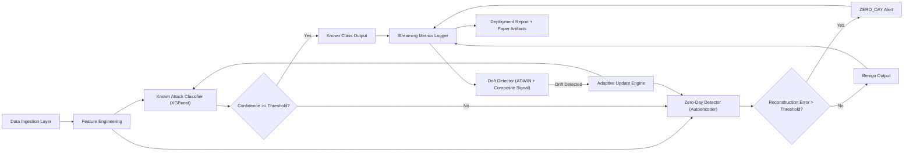

# SA-ZD-NIDS System Diagram

```mermaid
flowchart LR
    A["Data Ingestion Layer"] --> B["Feature Engineering"]
    B --> C["Known Attack Classifier (XGBoost)"]
    B --> D["Zero-Day Detector (Autoencoder)"]
    C --> E{"Confidence >= Threshold?"}
    E -->|"Yes"| F["Known Class Output"]
    E -->|"No"| D
    D --> G{"Reconstruction Error > Threshold?"}
    G -->|"Yes"| H["ZERO_DAY Alert"]
    G -->|"No"| I["Benign Output"]
    F --> J["Streaming Metrics Logger"]
    H --> J
    I --> J
    J --> K["Drift Detector (ADWIN + Composite Signal)"]
    K -->|"Drift Detected"| L["Adaptive Update Engine"]
    L --> C
    L --> D
    J --> M["Deployment Report + Paper Artifacts"]
```
